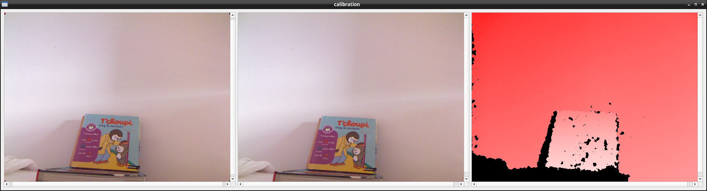
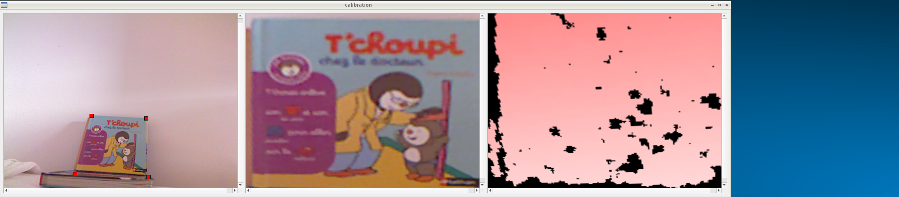

## Tools

### glview

The program given with libfreenect as a reference

### test-cv

A simple program to test OpenCV with the Kinect as input.

### calibrate-qt 

A program to calibrate the Kinect camera using OpenCV and Qt for the GUI to take 4 points as input.

